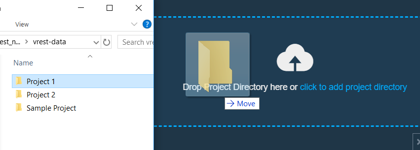

# vREST Desktop v0.5.4

This is a repository to maintain releases of vREST Desktop Application.

## vREST Desktop App

vREST Desktop has the following features and functionalities:

- Swagger/Postman Import
- Response Validation (Scriptless Assertions)
- Test Environments
- Authentication / Authorization Support
- Scriptless Assertions
- Chained Request Execution
- Community Support
- CI/CD Support
- Command Line Test Execution
- [Pro] Advanced Response Validation
- [Pro] Read Test Data from Excel Sheet
- [Pro] Data Driven Testing ( [Learn More](/sample-projects/data-driven-testing) )
- [Pro] Test Setup using shell commands/scripts
- [Pro] Priority Support
- [Pro] Advanced Failure Debugging

In order to explore this sample test data repository in vREST, you can follow the steps mentioned below:

## Step 1 - Download vREST Desktop

- First of all, you need to have vREST Application installed on your Desktop.
- Download it from [HERE](https://github.com/Optimizory/vrest-desktop/releases) (for your OS).

## Step 2 - Install vREST Desktop

- For installation, please visit our document on [os specific guide](https://desktop.vrest.io/docs/guide/getting-started/installation.html).

## Step 3 - Clone this repository & Open any of the sample projects in vREST Desktop Application

- You can clone this repository and keep it anywhere you want in your system.
- Once you have done that, you just have to open the sample projects in your vREST Workspace.

- Now, you can explore this Project on your own.

## Report Issues

To report any bugs or issues, you can simply do it in the [Issues Section](https://github.com/Optimizory/vrest-desktop/issues).

## Join our Discord Server

To interact (discuss/chat) with our team and others in the community, you can join [vREST Discord Server](https://discord.gg/XM97E6H).
